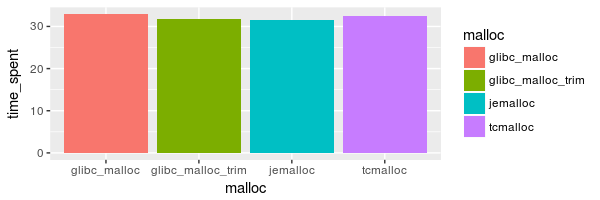
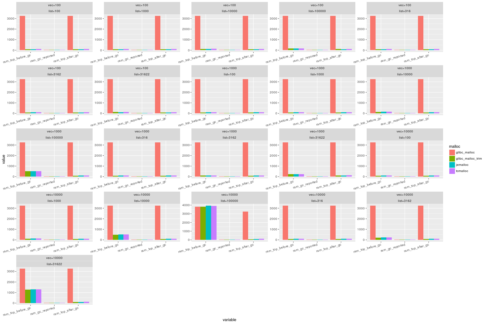
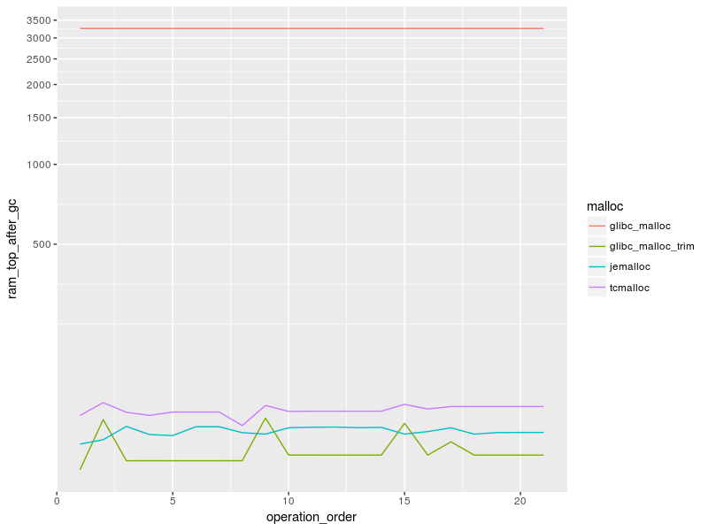
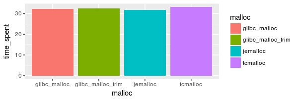
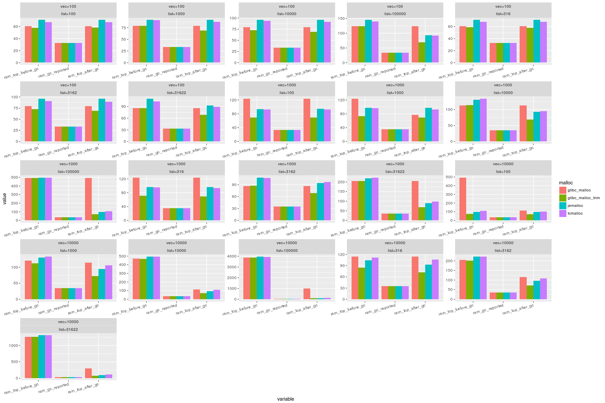
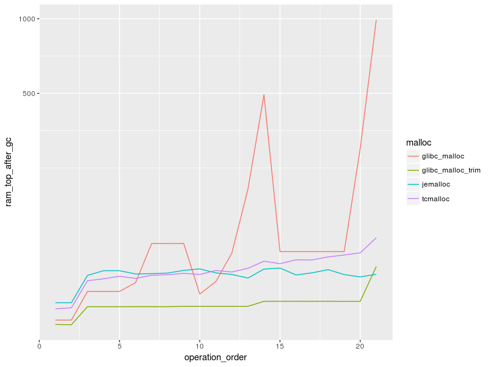

# Issue

It seems that heap **memory fragmentation on Linux** could be an issue for some R applications - OS can't release memory. In simple words - after deletion of the object which occupied **XXX** gb, R process still occupies **XXX** gb of memory according to `top`, but much more less according to R's `gc()`.

# Source of the issue

It seems that source of the issue is default **glibc** memory allocator. See this [thread at r-devel](https://stat.ethz.ch/pipermail/r-devel/2017-August/074761.html).

# Benchmark

In the benchmark we will try to OS release free memory from R process. We will create `list` of integer vectors. List size varies from 100 to 100000 elements and vetor size varies from 100 to 10000.

We will measure 3 allocators: 

1. **glibc**
1. **jemalloc**
1. **tcmalloc** 
1. Also in a separate run with **glibc** malloc we will register finalizer with `reg.finalizer` which will call **malloc_trim** upon `gc()`.

We will explore 2 strategies:

1. Create `list` of big objects first
1. Create `list` of small objects first


**General logic is following:**

```r
list_sizes = as.integer(10 ** seq(2, 5, 0.5))
vec_sizes = as.integer(10 ** (4:2))
for(vec_size in vec_sizes) {
  for(list_size in list_sizes) {
    generate_list(n_elem = vec_size, list_size = list_size)
  }
}
```

# Install memory allocators

**System set up**

* Ubuntu 16.04 LTS
* Xeon X3470
* 32gb RAM

```sh
sudo apt-get install -y libtcmalloc-minimal4 libjemalloc1
```

Also need to install `mallinfo` pkg by Simon Urbanek.
```r
install.packages('mallinfo',,'http://www.rforge.net/')
```

In order to create graphs we will need couple of more packages:
```r
install.packages(c("ggplot2", "data.table"))
```

## Big-to-small allocations

Here at the beginning we create biggest list of largest vectors first. Then list of smaller vectors and so on:
```
    vec_size list_size operation_order
 1:    10000    100000               1
 2:    10000     31622               2
 3:    10000     10000               3
 4:    10000      3162               4
 5:    10000      1000               5
 6:    10000       316               6
 7:    10000       100               7
 8:     1000    100000               8
 9:     1000     31622               9
10:     1000     10000              10
11:     1000      3162              11
12:     1000      1000              12
13:     1000       316              13
14:     1000       100              14
15:      100    100000              15
16:      100     31622              16
...
```

```sh
Rscript R/generate-data.R  data/create_big_obj_first/glibc_malloc.csv
Rscript R/generate-data.R  data/create_big_obj_first/glibc_malloc_trim.csv TRUE TRUE
env LD_PRELOAD=/usr/lib/x86_64-linux-gnu/libjemalloc.so.1 Rscript R/generate-data.R  data/create_big_obj_first/jemalloc.csv
env LD_PRELOAD=/usr/lib/libtcmalloc_minimal.so.4 Rscript R/generate-data.R  data/create_big_obj_first/tcmalloc.csv
```





## Small-to-big allocations

```
    vec_size list_size operation_order
 1:      100       100               1
 2:      100       316               2
 3:      100      1000               3
 4:      100      3162               4
 5:      100     10000               5
 6:      100     31622               6
 7:      100    100000               7
 8:     1000       100               8
 9:     1000       316               9
10:     1000      1000              10
11:     1000      3162              11
12:     1000     10000              12
13:     1000     31622              13
14:     1000    100000              14
15:    10000       100              15
16:    10000       316              16
...
```

```sh
Rscript R/generate-data.R  data/create_small_obj_first/glibc_malloc.csv FALSE
Rscript R/generate-data.R  data/create_small_obj_first/glibc_malloc_trim.csv FALSE TRUE
env LD_PRELOAD=/usr/lib/x86_64-linux-gnu/libjemalloc.so.1 Rscript R/generate-data.R  data/create_small_obj_first/jemalloc.csv FALSE
env LD_PRELOAD=/usr/lib/libtcmalloc_minimal.so.4 Rscript R/generate-data.R  data/create_small_obj_first/tcmalloc.csv FALSE
```



